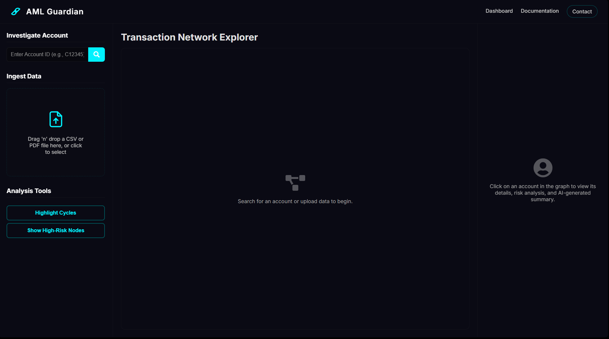

# AML Guardian: AI-Powered Money Laundering Detection System

AML Guardian is a full-stack web application that leverages machine learning and graph analytics to detect and visualize sophisticated money laundering patterns in transaction data.



---

## 👥 Group Members

<table>
	<tr>
		<td align="center"><br/><b>Walter White</b><br/><i>Group Leader</i></td>
		<td align="center"><br/><b>Jesse Pinkman</b></td>
		<td align="center"><br/><b>Saul Goodman</b></td>
		<td align="center"><br/><b>Skyler White</b></td>
		<td align="center"><br/><b>Hank Schrader</b></td>
	</tr>
</table>

---

## ✨ Features

- **High-Accuracy ML Model:** XGBoost and GNN models for robust fraud detection.
- **Graph Visualization:** Neo4j and D3.js for interactive network analysis.
- **Drag-and-Drop File Upload:** Simple CSV upload for transaction analysis.
- **Modern Stack:** React, Flask, Neo4j, Docker, and more.

---

## 🛠️ Technology Stack

- **Frontend:** React, Vite, D3.js, Axios, CSS Modules
- **Backend:** Python, Flask, Py2neo
- **Machine Learning:** Scikit-learn, XGBoost, Pandas, Imblearn, PyTorch (GNN)
- **Database:** Neo4j Graph Database
- **Deployment:** Docker, Docker Compose

# AML Guardian: AI-Powered Money Laundering Detection System

AML Guardian is a full-stack web application that leverages machine learning and graph analytics to detect and visualize sophisticated money laundering patterns in transaction data.


---

## ✨ Features

- **High-Accuracy ML Model:** XGBoost and GNN models for robust fraud detection.
- **Graph Visualization:** Neo4j and D3.js for interactive network analysis.
- **Drag-and-Drop File Upload:** Simple CSV upload for transaction analysis.
- **Modern Stack:** React, Flask, Neo4j, Docker, and more.

---

## 🛠️ Technology Stack

- **Frontend:** React, Vite, D3.js, Axios, CSS Modules
- **Backend:** Python, Flask, Py2neo
- **Machine Learning:** Scikit-learn, XGBoost, Pandas, Imblearn, PyTorch (GNN)
- **Database:** Neo4j Graph Database
- **Deployment:** Docker, Docker Compose

---

## 📁 Project Structure

```text
backend/    # Flask API, ML models, Neo4j integration
frontend/   # React app for UI and graph visualization
extension/  # Chrome extension for account analysis
ml/         # ML models, datasets, and Jupyter notebooks
```

---

## 🚀 Getting Started (Docker Recommended)

### Prerequisites

- [Docker](https://www.docker.com/get-started) & Docker Compose
- [Git](https://git-scm.com/)

### 1. Clone the Repository

```bash
git clone https://github.com/AnuragWaskle/money-laundering-detection-system.git
cd money-laundering-detection-system
```

### 2. Download the Dataset

- Download the PaySim dataset from [Kaggle](https://www.kaggle.com/datasets/ealaxi/paysim1).
- Place `PS_20174392719_1491204439457_log.csv` in `ml/data/raw/`.

### 3. (Optional) Retrain the ML Model

- Open `ml/notebooks/` and run the notebooks in order to retrain models. Pre-trained models are already provided.

### 4. Build and Run All Services

```bash
docker-compose up --build
```

### 5. Access the Application

- **Frontend:** [http://localhost:3000](http://localhost:3000)
- **Backend API:** [http://localhost:5001](http://localhost:5001)
- **Neo4j Browser:** [http://localhost:7474](http://localhost:7474) (user: `neo4j`, pass: `password`)

---

## 🧑‍💻 Manual (Local) Development

### Backend

**To run any Python code or the backend server locally, always use a virtual environment and install dependencies from `requirements.txt`:**

```bash
<<<<<<< HEAD
=======
cd backend
>>>>>>> 878aa4807e99ba5a524b32f89c231a7c1196f533
# Create a virtual environment (only once)
python -m venv venv
# Activate the environment (Windows)
venv\Scripts\activate
# Or on Mac/Linux:
# source venv/bin/activate
# Upgrade pip, setuptools, wheel (recommended)
python -m pip install --upgrade pip setuptools wheel
# Install all dependencies
pip install -r requirements.txt
<<<<<<< HEAD
```

```bash
cd backend
=======
>>>>>>> 878aa4807e99ba5a524b32f89c231a7c1196f533
# Run the backend server
python app.py
```

> **Note:** Always activate your virtual environment before running Python scripts or Jupyter notebooks to ensure the correct dependencies are used.

### Frontend

```bash
cd frontend
npm install
npm run dev
# Open http://localhost:5173
```

### Chrome Extension

1. Go to `chrome://extensions/` in Chrome.
2. Enable Developer Mode.
3. Click "Load unpacked" and select the `extension/` folder.

---

## 📊 Usage

1. Upload a transaction CSV file on the dashboard.
2. Click "Start Analysis".
3. View summary statistics and interactive transaction graphs.

---

## 🧪 Testing

- **Backend:** Test API endpoints (e.g., `/api/account-summary/<account_id>`) with Postman or curl.
- **Frontend:** Verify UI and API calls at the frontend URL.
- **Extension:** Test popup with a valid account ID from Neo4j.

<<<<<<< HEAD
---
=======
<!-- ---
>>>>>>> 878aa4807e99ba5a524b32f89c231a7c1196f533

## 📝 Notes

- Ensure Neo4j credentials are set in `backend/.env` if you override defaults.
<<<<<<< HEAD
- Replace placeholder icons in `extension/icons/` with your own PNGs (16x16, 48x48, 128x128).
- For large datasets, consider using Git LFS.
=======
- For large datasets, consider using Git LFS. -->
>>>>>>> 878aa4807e99ba5a524b32f89c231a7c1196f533
